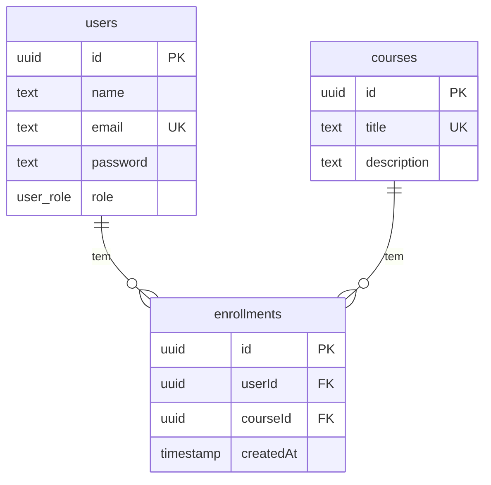

# Desafio API Node.js

Uma API em Node.js para gerenciar cursos e matrículas de estudantes.

## Tecnologias

- [Node.js](https.://nodejs.org/en)
- [Fastify](https://www.fastify.io/)
- [Drizzle ORM](https://orm.drizzle.team/)
- [PostgreSQL](https://www.postgresql.org/)
- [Docker](https://www.docker.com/)

## Começando

### Pré-requisitos

- [Node.js](https://nodejs.org/en)
- [Docker](https://www.docker.com/)

### Instalação

1. Clone o repositório
   ```sh
   git clone https://github.com/seu-usuario/desafio-api-node-js.git
   ```
2. Instale as dependências
   ```sh
   npm install
   ```
3. Inicie o container do banco de dados
   ```sh
   docker-compose up -d
   ```
4. Rode as migrations
   ```sh
   npm run db:migrate
   ```
5. Inicie o servidor de desenvolvimento
   ```sh
   npm run dev
   ```

## Endpoints da API

A API inclui os seguintes endpoints:

- `POST /login`: Autentica um usuário e retorna um token JWT.
- `GET /courses`: Retorna uma lista de todos os cursos.
- `GET /courses/:id`: Retorna um curso pelo seu ID.
- `POST /courses`: Cria um novo curso.

## Schema do Banco de Dados


